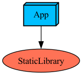

### Tuist 환경에서 API key 숨기기

#### 프로젝트 구조

- Static Library 모듈에서 실제 파일(Env.plist)에서 API key를 로드한다음 사용함.
- App 모듈은 import StaticLibrary를 통해서만 apiKey값에 접근할 수 있음
- 예를들어 App모듈이 Presentation 레이어에 있고 StaticLibrary가 Domain 레이어에 있다고 한다면 StaticLibrary모듈에서만 Env.plist파일에 접근해서 apiKey를 로드한다음 네트워크 통신후 모델만 App모듈에 넘겨주는 역할

##### 그냥
- apikey를 숨기는 방법은 여러가지가 있는듯. XCConfig파일 사용, Foundation의 NSFileManager 사용, Tuist 프로젝트 설정에서 script 사용하기 등등
- 위 방법 쓴 이유는 제일 간단해서.. tuist가 swiftgen을 사용해서 resource를 간편하게 불러올 수 있음. 기본 템플릿을 사용해서 불러올 수 있는 파일들 중 plist가 있어서 사용
- 로컬에서 직접 plist 파일을 생성하고 관리해야해서 apiKey를 작성하는 참고문서를 만들어놔야할듯.
- 가장 깔끔한 방법은 script, 또는 깃헙 private 레포 생성한다음 apikey관련 파일넣고 private 레포를 의존하는 방법?